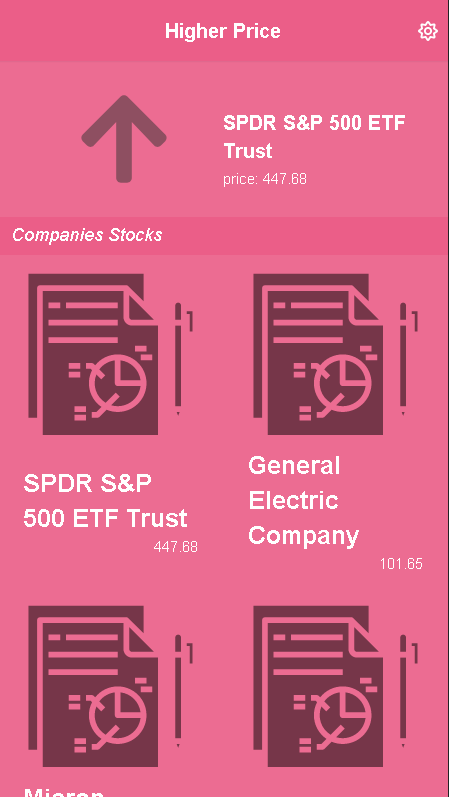
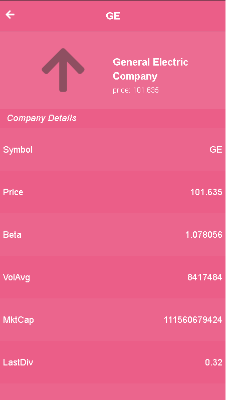

# Capstone Project

This Web application is about building a mobile web application to check a list of stocks of the market, filter and see data about an specific company and compare it with other companies.

-   
-   

## :red_circle: Live Demo and Explaining Video

- [Github](https://miguelesco.github.io/capstone-m3/#/) 

## :hammer: Built With

- React and Javascript.

To get a local copy up and running follow these simple steps:

1. Go to the [repository page](https://github.com/miguelesco/capstone-m3/).
2. Press the "Code" button and copy the link.
3. Clone it using git command `git clone <link>`.
4. In the project folder run `npm install`
5. Then run in the terminal `npm run start` (for development enviroment) or `npm run build`

## :blue_book: Learning Objectives

- Use React documentation.
- Use React components.
- Use React props.
- Use React Router.
- Connect React and Redux.
- Handle events in a React app.
- Write integration tests with a React testing library.
- Use styles in a React app.
- Use React life cycle methods.
- Apply React best practices and language style guides in code.
- Use store, actions and reducers in React.

## Authors

👤 **Miguelesco**

- GitHub: [@Miguelesco](https://github.com/miguelesco)

## 🤝 :raised_hand: :raised_hand: Contributions

Contributions, issues, and feature requests are welcome!

Feel free to check the [issues page](https://github.com/miguelesco/capstone-m3/issues).

## :grey_exclamation: Acknowledgments

- [Microverse](https://www.microverse.org/)

Design:
 - Original design idea by [Nelson Sakwa on Behance](https://www.behance.net/sakwadesignstudio)
 - Licenced under The [Creative Commons license](https://creativecommons.org/licenses/by-nc/4.0/)

## 📝 License

This project is [MIT](LICENSE) licensed.
